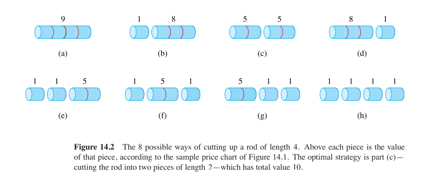

动态规划一般用来解决最优化问题
解决动态规划问题的四个步骤
1. Characterize the structure of an optimal solution.(寻找最优解结构)
2. Recursively define the value of an optimal solution.(最优解的递归函数,状态转移)
3. Computing (Algorithms): Compute the value of an optimal solution in a bottom-up fashion(动态规划算法:按自底向上的方式计算最优值)
4. Construct an optimal solution from computed information. (计算一个最优解)

在算法导论中主要讲了以下个问题
# 钢条切割
长度为 n 的钢管,一种最优的切割方式:$n = i_1 + i_2 +...+ i_k$
切割为$k$段,$1 ≤ k ≤ n$, 每段的长度为 $i_1, i_2, . . . , i_k$ ,最大收益为:$r_n = p_{i_1} + p_{i_2} +...+ p_{i_k}$
$r_n$ : $n$米长钢管的最优切割方式(最优:价格最高,收益最大)

一种方式我们可以遍历切割位置，递归求解：
$$\begin{align}r_n = max \{p_n , r_1 +r_{n-1}, r_2 + r_{n-2},...,r_{n-1} + r_1\}\end{align}$$
如果要解决大小为$n$的问题，就需要先解决形式一样，规模更小的子问题。通过子问题的最优解，构建原问题的最优解。我们称钢条切割问题满足**最优子结构**。
除了上述的遍历方法，我们还可以找到另一种遍历方法：遍历切割的第一刀的位置，于是
$$\begin{align}r_n = max \{p_i + r_{n-i} : 1 \leq i \leq n \} \end{align}$$
## 自顶向下递归实现

```C++
int CutRod(vector<int> p, int n) {
    if (n == 0)
        return 0;
    int q = INT_MIN;
    for (int i = 1; i <= n; i++) {
        q = max(q, p[i] + CutRod(p, n - i));
    }
    return q;
}
```
在这种方法里调用时会有很多重复的冗余计算，导致时间复杂度指数级增长$T (n) = n + \sum_{j = 0}^{n-1}T(j) \rightarrow T(n) = 2^n$

我们可以将计算出的子问题结果保存下来，之后若需要子问题的答案只需要查找保存结果不必重新计算
动态规划有两种等价的实现方法
## 带备忘的自顶向下法
先检查是否计算过自问题的答案，如果计算过，直接返回保存的值;否则，用通常方法计算`q`并保存
```c++
int MemoizedCutRod(const std::vector<int> &p, int n, std::vector<int> &r) {
    if (r[n] >= 0) {
        return r[n];
    }
    int q;
    if (n == 0) {
        q = 0;
    } else {
        q = INT_MIN;
        for (int i = 0; i <= n; i++) {
            q = std::max(q, p[i] + MemoizedCutRod(p, n - i, r));
        }
    }
    r[n] = q;
    return q;
}
```
## 自底向上法
依次求解$j = 0,1,...,n$的子问题，得到结果
```C++
int BottomUpCutRod(const std::vector<int> &p, int n, std::vector<int> &r) {
    r[0] = 0;
    for (int j = 1; j <= n; j++) {
        int q = INT_MIN;
        for (int i = 1; i <= j; i++) {
            q = std::max(q, p[i] + r[j - i]);
        }
        r[j] = q;
    }
    return r[n];
}
```
为了得到最优解的切割方式，我们可以在循环中记录下`i`的值，即每次切割的位置
```C++
int ExtendedBottomUpCutRod(const std::vector<int> &p, int n,
                           std::vector<int> &r, std::vector<int> &s) {
    r[0] = 0;
    for (int j = 1; j <= n; j++) {
        int q = INT_MIN;
        for (int i = 1; i <= j; i++) {
            if (q < p[i] + r[j - i]) {
                q = p[i] + r[j - i];
                s[j] = i;
            }
        }
        r[j] = q;
    }
    return r[n];
}

void PrintCutRodSolution(const std::vector<int> &p, int n) {
    std::vector<int> r(n + 1);
    std::vector<int> s(n + 1);

    ExtendedBottomUpCutRod(p, n, r, s);

    while (n > 0) {
        std::cout << s[n] << " ";
        n = n - s[n];
    }
    std::cout << std::endl;
}
```

# 最长相同子序列(Longest common subsequence)
Given two sequences$X= <x_1, x_2, ..., x_m>$and$Y=<y_1, y_2, ..., y_n>$, how to find a maximum-lengthcommon subsequence of $X$ and $Y$ .
(给定两个子序列 $X$ 和 $Y$ ,如何寻找 $X$ 和 $Y$ 的长度最大的相同子序列)
## 最优子结构
Let $Z = < z_1, ..., z_{k-1} , z_k >$ be any LCS of $X = < x_1, ..., x_{m-1} , x_m >$ and $Y = < y_1, ..., y_{n-1} , y_n >$ .
1. If $x_m=y_n$, then $z_k=x_m=y_n$ and $Z_{k-1}$ is an LCS of $X_{m-1}$ and $Y_{n-1}$.
2. If $x_m≠y_n$, then $z_k≠x_m$ ⇒ $Z$ is an LCS of $X_{m-1}$ and $Y$.
3. If $x_m≠y_n$, then $z_k≠y_n$ ⇒ $Z$ is an LCS of $X$ and $Y_{n-1}$.

$c[i,j]=\begin{cases}0,&i=0\;\text{或}\;j=0\\[6pt]c[i-1,j-1]+1,&i,j>0\;\text{且}\;x_i=y_j\\[6pt]\max\!\bigl(c[i-1,j],\;c[i,j-1]\bigr),&i,j>0\;\text{且}\;x_i\ne y_j\end{cases}$

```C++
#include <bits/stdc++.h>
using namespace std;

/* 回溯输出一条 LCS */
string buildLCS(const string &a, const string &b, const vector<vector<int>> &c,
                int i, int j) {
    string ans;
    while (i > 0 && j > 0) {
        if (a[i - 1] == b[j - 1]) { // 匹配字符
            ans.push_back(a[i - 1]);
            --i;
            --j;
        } else if (c[i - 1][j] >= c[i][j - 1])
            --i; // 向上
        else
            --j; // 向左
    }
    reverse(ans.begin(), ans.end());
    return ans;
}

int main() {
    ios::sync_with_stdio(false);
    cin.tie(nullptr);

    string a, b;
    cin >> a >> b;
    int m = a.size(), n = b.size();

    vector<vector<int>> c(m + 1, vector<int>(n + 1, 0));

    /* 1. 填 DP 表 */
    for (int i = 1; i <= m; ++i)
        for (int j = 1; j <= n; ++j)
            if (a[i - 1] == b[j - 1])
                c[i][j] = c[i - 1][j - 1] + 1;
            else
                c[i][j] = max(c[i - 1][j], c[i][j - 1]);

    /* 2. 输出长度 */
    cout << c[m][n] << '\n';

    /* 3. 输出一条具体 LCS */
    string lcs = buildLCS(a, b, c, m, n);
    cout << lcs << '\n';
    return 0;
}
```

# 矩阵乘法 Matrix-chain multiplication (MCM)
Given a sequence (chain)$<A1, A2, ..., An>$of n matrices to be multiplied, and we wish to compute the product
n 个矩阵相乘 ,称为‘矩阵连乘’(或矩阵链乘法),如何求积?
The way we parenthesize a chain of matrices can have a dramatic impact
on the cost of evaluating the product.
可以肯定，这个问题的时间复杂度是$O(n^3)$，但是由于矩阵乘法的顺序不同，可能导致乘法运算次数差距很大，于是我们就有了矩阵链乘法问题
We state the matrix-chain multiplication problem as follows: given a chain$<A_1, A_2 , ... ,A_n >$ of n matrices, where for $i = 1, 2, ... , n$, matrix $A_i$ has dimension$p_{i-1}\times  p_i$, fully parenthesize the product $A_1, A_2 , ... ,A_n$ in a way that minimizes
the number of scalar multiplications. The input is the sequence of dimensions
$<p_0, p_1, p_2 , ... ,p_n >$ 
## 最优子结构
$Ai..j (i ≤ j )$ : 矩阵连乘 $A_i A_{i+1} ...A_k A_{k+1}... A_j$
- 非平凡情况下,全括号$A_iA_{i+1}...A_j$必定在位置 k 把问题分成两个部分,如下
- $A_{i..k}·A_{k+1..j}= A_{i..j}$全括号 $A_iA_{i+1}...A_j$ 的计算代价(标量乘法):$cost(A_{i..j})$

$cost(A_{i..j}) = cost(A_{i..k}) + cost(A_{k+1..j}) +$the cost of multiplying$A_{i..k}·A_{k+1..j}$
最优子结构:$A_{i..j}$ 的最优全括号$X$中的 $A_{i..k}$ 的全括号$M$必定是$A_{i..k}$ 的最优全括号
需要考虑所有分割位置 k 以确保最优解是其中之一
$m[i, j]$ : $A_{i..j}$的最优全括号的标量乘法次数
$m[i, j] = m[i, k] + m[k+1, j] + p_{i-1}p_kp_j$
于是:

$m[i, j] = \begin{cases}0, & \text{if } i = j \\[6pt]\displaystyle \min_{i \leq k < j} \left\{ m[i, k] + m[k+1, j] + p_{i-1} p_k p_j \right\}, & \text{if } i < j\end{cases}$

```C++
#include <climits>
#include <iostream>
#include <vector>

using namespace std;

/* 递归打印最优括号化 */
void printOptimalParens(const vector<vector<int>> &s, int i, int j) {
    if (i == j) {
        cout << "A" << i; // 单个矩阵
    } else {
        cout << "(";
        printOptimalParens(s, i, s[i][j]);
        printOptimalParens(s, s[i][j] + 1, j);
        cout << ")";
    }
}

int main() {
    ios::sync_with_stdio(false);
    cin.tie(nullptr);

    int n;
    if (!(cin >> n))
        return 0; // 矩阵个数
    vector<int> p(n + 1);
    for (int i = 0; i <= n; ++i)
        cin >> p[i];

    vector<vector<int>> m(n + 1, vector<int>(n + 1, 0));
    vector<vector<int>> s(n + 1, vector<int>(n + 1, 0));

    /* 按链长 l 从小到大 DP */
    for (int l = 2; l <= n; ++l) {             // l=2..n
        for (int i = 1; i <= n - l + 1; ++i) { // 起点
            int j = i + l - 1;                 // 终点
            m[i][j] = INT_MAX;
            for (int k = i; k < j; ++k) {
                int cost = m[i][k] + m[k + 1][j] + p[i - 1] * p[k] * p[j];
                if (cost < m[i][j]) {
                    m[i][j] = cost;
                    s[i][j] = k;
                }
            }
        }
    }

    cout << m[1][n] << "\n";     // 最少乘法次数
    printOptimalParens(s, 1, n); // 最优括号化
    cout << "\n";
    return 0;
}
```
# 最优二叉搜索树
## 最优子结构
设$T'$为`OBST`$T$的一个子树,$T'$包含`keys`$k_i, ..., k_j$, 那么
$T'$ 是子问题[关于`keys` $k_i, ..., k_j$ 和`dummy keys`$d_{i-1} , ..., d_j$]的`OBST`

证明思想:剪切粘贴法
设 `BST` $T$ 的搜索代价最小,$T'$ 是$T$的搜索子树。如果$T$的一颗搜索子树$T''$的搜索代价比$T'$的搜索代价更小,在搜索树$T$中把$T'$换成$T''$ ,得到一颗新的搜索树$T'''$,其搜索代价比$T$更小,与假设矛盾。

设$e[i, j]$: 一颗`OBST`的搜索代价,最优值
可以得到
$$\begin{align}e[i, i-1] = q_{i-1}\end{align}$$
定义添加一个节点，期望搜索代价增加值为$w[i, j]$
$$\begin{align}w[i, j]=\sum_{l = i}^{j}p_i+\sum_{l = i - 1}^{j}q_i\end{align}$$
如果$k_r$是 `keys` $k_i , ... , k_j$的一颗OBST 的树根,则
$$\begin{align}
e[i, j] &= p_r+ ( e[i, r-1] + w[i, r-1] )+ ( e[r+1, j] + w[r+1, j] ) \\ 
    &= e[i, r-1] + e[r+1, j] + w[i, j]
\end{align}$$
通过两部分的递归公式可以得到递推式
```C++
struct OBSTResult {
    vector<vector<int>> e;    // e[i][j]: 包含key i到j的最优BST的期望搜索代价
    vector<vector<int>> w;    // w[i][j]: key i到j的概率之和
    vector<vector<int>> root; // root[i][j]: key i到j的最优根
};

OBSTResult OBST(vector<int> p, vector<int> q, int n) {
    // p: p[1..n] 是搜索key ki的概率
    // q: q[0..n] 是搜索失败的概率（哑键的概率）
    // n: 关键字的个数

    OBSTResult result;
    result.e.assign(n + 2, vector<int>(n + 1, 0));
    result.w.assign(n + 2, vector<int>(n + 1, 0));
    result.root.assign(n + 1, vector<int>(n + 1, 0));

    // 初始化：长度为0的子树
    for (int i = 1; i <= n + 1; i++) {
        result.e[i][i - 1] = q[i - 1];
        result.w[i][i - 1] = q[i - 1];
    }

    // l: 子树中包含的关键字个数
    for (int l = 1; l <= n; l++) {
        // 对于包含l个关键字的所有子树
        for (int i = 1; i <= n - l + 1; i++) {
            int j = i + l - 1;

            result.e[i][j] = INT_MAX;
            result.w[i][j] = result.w[i][j - 1] + p[j] + q[j];

            // 尝试ki, ki+1, ..., kj中的每一个作为根
            for (int r = i; r <= j; r++) {
                int t =
                    result.e[i][r - 1] + result.e[r + 1][j] + result.w[i][j];

                if (t < result.e[i][j]) {
                    result.e[i][j] = t;
                    result.root[i][j] = r;
                }
            }
        }
    }

    return result;
}
```