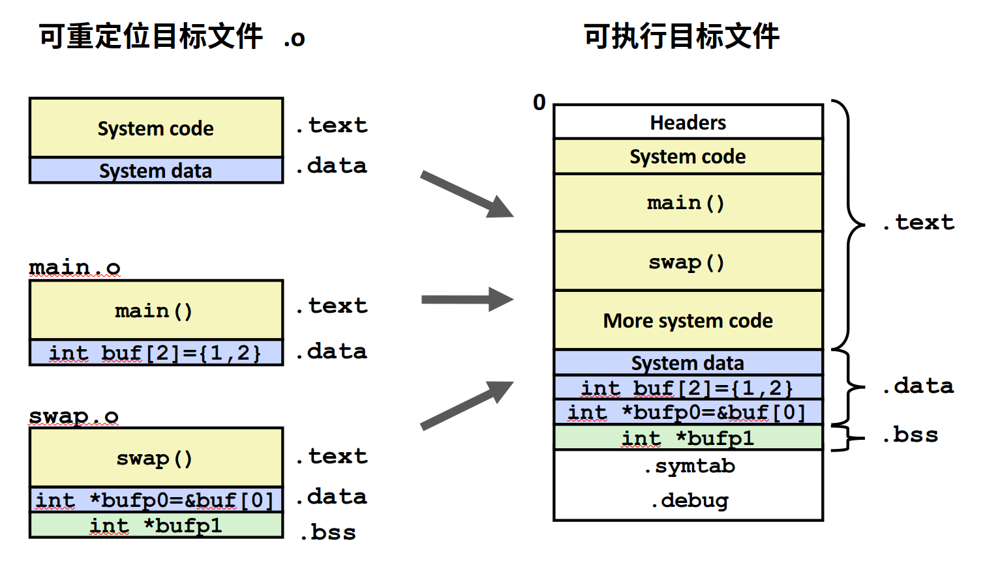
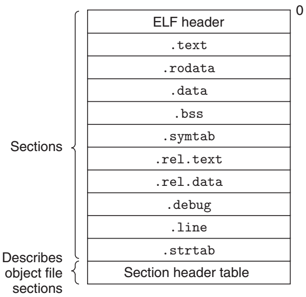

**链接**:链接是将各种代码和数据段收集并组合为一个单一文件的过程，这个文件可被加载到内存并执行。

## 静态链接

为了说明什么是链接，我们可以通过例子分析

```C
\\main.c
void swap();

int buf[2] = {1,2};

int main(){
    swap();
    return 0;
}
```
```C
\\swap.c
extern int buf[];

int *bufp0 = &buf[0];
int *bufp1;

void swap() {
    int temp;
    
    bufp1 = &buf[1];
    temp = *bufp0;
    *bufp0 = *bufp1;
    *bufp1 = temp;
}
```
### 符号解析
首先编译器会对程序进行语法分析，找到程序的定义和引用
我们可以通过将`main.c`和`swap.c`编译成`.o`文件得到每个符号的引用和定义
```shell
$ gcc -c swap.c
$ gcc -c main.c
```
可以通过`readelf`来查看两个文件里的符号表
```shell
$ readelf -s main.o

Symbol table '.symtab' contains 6 entries:
   Num:    Value          Size Type    Bind   Vis      Ndx Name
     0: 0000000000000000     0 NOTYPE  LOCAL  DEFAULT  UND 
     1: 0000000000000000     0 FILE    LOCAL  DEFAULT  ABS main.c
     2: 0000000000000000     0 SECTION LOCAL  DEFAULT    1 .text
     3: 0000000000000000     8 OBJECT  GLOBAL DEFAULT    3 buf
     4: 0000000000000000    25 FUNC    GLOBAL DEFAULT    1 main
     5: 0000000000000000     0 NOTYPE  GLOBAL DEFAULT  UND swap

$ readelf -s swap.o

Symbol table '.symtab' contains 7 entries:
   Num:    Value          Size Type    Bind   Vis      Ndx Name
     0: 0000000000000000     0 NOTYPE  LOCAL  DEFAULT  UND 
     1: 0000000000000000     0 FILE    LOCAL  DEFAULT  ABS swap.c
     2: 0000000000000000     0 SECTION LOCAL  DEFAULT    1 .text
     3: 0000000000000000     8 OBJECT  GLOBAL DEFAULT    5 bufp0
     4: 0000000000000000     0 NOTYPE  GLOBAL DEFAULT  UND buf
     5: 0000000000000000     8 OBJECT  GLOBAL DEFAULT    4 bufp1
     6: 0000000000000000    67 FUNC    GLOBAL DEFAULT    1 swap
```
可以看到，`main.o`里的`swap`和`swap.o`里的`buf`这两个符号的`Ndx`属性是`UND`，就是`undefined`的。在程序里都是从外部引用但是单独编译的话编译器是没办法找到对应的定义。
### 重定位
既然`main`中的符号在`swap`中，`swap`中的符号在`main`中,那把两个文件合并成一个目标文件，不就解决问题了？
这就是静态链接的目的
```shell
$ ld main.o swap.o -e main -o main
```
`-e main`指定链接后程序的入口是`main`函数,`-o main`表示链接后的文件名,就得到了可执行文件`main`
```shell
$ readelf -s main

Symbol table '.symtab' contains 11 entries:
   Num:    Value          Size Type    Bind   Vis      Ndx Name
     0: 0000000000000000     0 NOTYPE  LOCAL  DEFAULT  UND 
     1: 0000000000000000     0 FILE    LOCAL  DEFAULT  ABS main.c
     2: 0000000000000000     0 FILE    LOCAL  DEFAULT  ABS swap.c
     3: 0000000000403008     8 OBJECT  GLOBAL DEFAULT    4 bufp0
     4: 0000000000401019    67 FUNC    GLOBAL DEFAULT    2 swap
     5: 0000000000403010     0 NOTYPE  GLOBAL DEFAULT    5 __bss_start
     6: 0000000000401000    25 FUNC    GLOBAL DEFAULT    2 main
     7: 0000000000403000     8 OBJECT  GLOBAL DEFAULT    4 buf
     8: 0000000000403010     0 NOTYPE  GLOBAL DEFAULT    4 _edata
     9: 0000000000403018     0 NOTYPE  GLOBAL DEFAULT    5 _end
    10: 0000000000403010     8 OBJECT  GLOBAL DEFAULT    5 bufp1
```
现在`main`、`buf`、`swap`三个符号都有，并且不再是`UND`
那么链接是怎么把两个二进制文件组合到一起呢
就是对应字段的组合

```shell
$ objdump -h main.o

main.o:     file format elf64-x86-64

Sections:
Idx Name          Size      VMA               LMA               File off  Algn
  0 .text         00000019  0000000000000000  0000000000000000  00000040  2**0
                  CONTENTS, ALLOC, LOAD, RELOC, READONLY, CODE
  1 .data         00000008  0000000000000000  0000000000000000  00000060  2**3
                  CONTENTS, ALLOC, LOAD, DATA
  2 .bss          00000000  0000000000000000  0000000000000000  00000068  2**0
                  ALLOC
  3 .comment      0000002c  0000000000000000  0000000000000000  00000068  2**0
                  CONTENTS, READONLY
  4 .note.GNU-stack 00000000  0000000000000000  0000000000000000  00000094  2**0
                  CONTENTS, READONLY
  5 .note.gnu.property 00000020  0000000000000000  0000000000000000  00000098  2**3
                  CONTENTS, ALLOC, LOAD, READONLY, DATA
  6 .eh_frame     00000038  0000000000000000  0000000000000000  000000b8  2**3
                  CONTENTS, ALLOC, LOAD, RELOC, READONLY, DATA
$ objdump -h swap.o

swap.o:     file format elf64-x86-64

Sections:
Idx Name          Size      VMA               LMA               File off  Algn
  0 .text         00000043  0000000000000000  0000000000000000  00000040  2**0
                  CONTENTS, ALLOC, LOAD, RELOC, READONLY, CODE
  1 .data         00000000  0000000000000000  0000000000000000  00000083  2**0
                  CONTENTS, ALLOC, LOAD, DATA
  2 .bss          00000008  0000000000000000  0000000000000000  00000088  2**3
                  ALLOC
  3 .data.rel     00000008  0000000000000000  0000000000000000  00000088  2**3
                  CONTENTS, ALLOC, LOAD, RELOC, DATA
  4 .comment      0000002c  0000000000000000  0000000000000000  00000090  2**0
                  CONTENTS, READONLY
  5 .note.GNU-stack 00000000  0000000000000000  0000000000000000  000000bc  2**0
                  CONTENTS, READONLY
  6 .note.gnu.property 00000020  0000000000000000  0000000000000000  000000c0  2**3
                  CONTENTS, ALLOC, LOAD, READONLY, DATA
  7 .eh_frame     00000038  0000000000000000  0000000000000000  000000e0  2**3
                  CONTENTS, ALLOC, LOAD, RELOC, READONLY, DATA
$ objdump -h main

main:     file format elf64-x86-64

Sections:
Idx Name          Size      VMA               LMA               File off  Algn
  0 .note.gnu.property 00000020  00000000004001c8  00000000004001c8  000001c8  2**3
                  CONTENTS, ALLOC, LOAD, READONLY, DATA
  1 .text         0000005c  0000000000401000  0000000000401000  00001000  2**0
                  CONTENTS, ALLOC, LOAD, READONLY, CODE
  2 .eh_frame     00000058  0000000000402000  0000000000402000  00002000  2**3
                  CONTENTS, ALLOC, LOAD, READONLY, DATA
  3 .data         00000010  0000000000403000  0000000000403000  00003000  2**3
                  CONTENTS, ALLOC, LOAD, DATA
  4 .bss          00000008  0000000000403010  0000000000403010  00003010  2**3
                  ALLOC
  5 .comment      0000002b  0000000000000000  0000000000000000  00003010  2**0
                  CONTENTS, READONLY
```
通过`objdump`也可以看出来`main.o`的`.text`段大小为`00000019`,`swap.o`的`.text`段大小为`00000043`,生成的`main`文件`.text`段大小为`0000005c`
,由此验证了链接的规则

## 目标文件的三种形式
1. 可重定位目标文件(relocatable object file: .o(Linux); .obj(Windows))
    - 包含二进制代码和数据
    - 其形式可以在编译时与其他可重定位目标文件合并起来，创建一个可执行目标文件
2. 可执行目标文件
    - 可以没有扩展名(Linux)或者 a.out ;.exe(Windows)
    - 可直接加载到内存
3. 共享目标文件
    - 可以在加载或者运行时被动态地加载进内存并链接
    - windows：.dll(动态链接库)；Linux：.so(动态链接)

在linux下，我们可以通过`file`命令来查看目标文件的形式
```shell
$ file main.o
main.o: ELF 64-bit LSB relocatable, x86-64, version 1 (SYSV), not stripped
$ file main
main: ELF 64-bit LSB executable, x86-64, version 1 (SYSV), statically linked, not stripped
$ file /lib32/libmemusage.so
/lib32/libmemusage.so: ELF 32-bit LSB shared object, Intel 80386, version 1 (SYSV), dynamically linked, BuildID[sha1]=2bc3203b302795968748f6e787828793b05f6b8b, for GNU/Linux 3.2.0, stripped
```


|常用段名|说明|
|-|-|
|.text|编译后的机器码|
|.rodata|read only data 只读数据(const、字符串)|
|.data|已初始化的全局变量和局部静态变量|
|.bbs|block started by symbol 未初始化的全局和静态变量。只是预留一个未定义的全局变量符号|
|.symtab|符号表:存放函数和全局变量信息|
|.rel.text|.text节重定位信息，合成可执行文件是需要重定位的指令和指针|
|.rel.data|.data节重定位的信息|
|.debug、.line|调试符号表|
|.strtab|字符串表|

## 符号解析
符号表里的符号有一下几类
- 定义在本目标文件的全局符号，可以被其他目标文件引用
- 在本目标文件引用的全局符号，却没有定义在本目标文件，叫做**外部符号**
- 段名，由编译器产生，值就是起始地址
- 局部符号，只在编译单元内部可见。对于链接过程没有用，链接器也会忽略他们
- 行号信息，目标文件指令与源代码重代码行的对应关系

### 弱符号与强符号
- 强符号:函数和已初始化的全局变量
- 弱符号:未初始化的全局变量和外部符号(extern)

符号链接的规则：
- 规则1:不允许强符号被多次定义;如果有多个强符号定义,则链接器报符号重复定义错误
- 规则2:如果一个符号在某个目标文件中是强符号,在其他文件中是弱符号,那么选择强符号
- 规则3:如果一个符号在所有目标文件中都是弱符号，那么先择器其中占用空间最大的一个