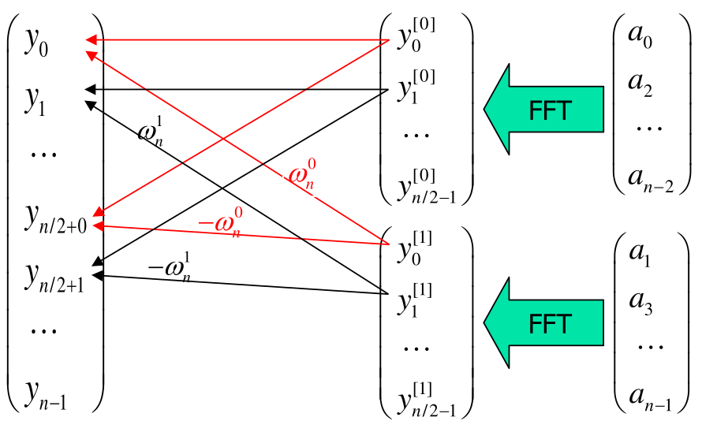
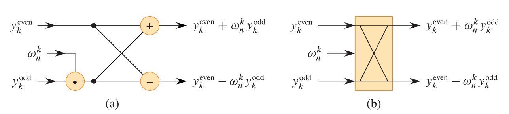
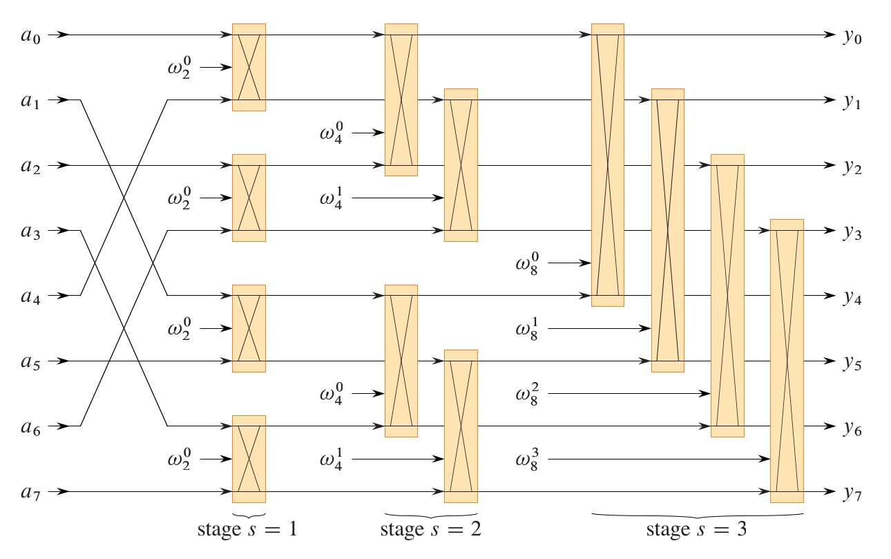

从多项式的乘法引入，
$A(x)$, $B(x)$, degree-bound $n$  最高此项为$n$

$C(x) = A(x) · B(x)$, degree-bound $2n − 1$  
$= \sum_{j=0}^{2n-2}{c_jx^j}$

我们可以通过把两个多项式正常的相乘，这种计算方法的时间复杂度是$O(n^2)$

同时我们也可以使用卷积

C(x) 的系数满足$C_j = \sum_{j=0}^{2*n-2} c_jx^j, \quad c_j = \sum_{k=0}^{j} a_k b_{j-k} $
也就是
$$ a \otimes b = (a_0, a_1, \cdots, a_{n-1}) \otimes (b_0, b_1, \cdots, b_{n-1}) = (c_0, c_1, \cdots, c_{2n-2}) $$
where, $$ c_j = a_0 b_j + a_1 b_{j-1} + \cdots + a_k b_{j-k} + \cdots + a_j b_0 $$

可以看到这种算法的时间复杂度也是$O(n^2)$，那么有没有比$O(n^2)$更快的算法呢？我们就可以用Fast Fourier Transform (FFT, [快速傅里叶变换算法]),将时间复杂度降低到$O(nlogn)$


为了理解FFT我们先从离散傅利叶变换DFT开始讲，还是回到刚才那个多项式乘法的例子。一个多项式，我们从函数的视角来看，提取每一个项的系数，我们可以将一个n次多项式写成一个n维向量。

换一种思路，我们是不是也可以用n个离散的点来代表一个函数。二次函数中我们如果知道三个点，可以通过解方程的方式将每一项的系数解出来，那是不是n次方程也可以用n个点来表示。
$$
\begin{pmatrix}
y_0 \\
y_1 \\
\vdots \\
y_{n-1}
\end{pmatrix}
=
\begin{pmatrix}
1 & x_0 & x_0^2 & \cdots & x_0^{n-1} \\
1 & x_1 & x_1^2 & \cdots & x_1^{n-1} \\
\vdots & \vdots & \vdots & \ddots & \vdots \\
1 & x_{n-1} & x_{n-1}^2 & \cdots & x_{n-1}^{n-1}
\end{pmatrix}
\begin{pmatrix}
a_0 \\
a_1 \\
\vdots \\
a_{n-1}
\end{pmatrix}
= V(x_0, x_1, \cdots, x_{n-1}) \cdot a
$$

如果用点来表示的话，两个多项式相乘就可以用对应x处的值相乘得到2n+1个点解出原方程，我们就将之间复杂度降低到$O(n)$,极大的提高了计算效率!

那么现在的问题就是，我们如何选取这2n+1个点然后再将其转换回多项式的系数呢？

一种方法我们可以用Lagrange插值得到多项式
$$A(x) = \sum_{k=0}^{n-1} y_k \frac{\prod_{j \neq k}(x - x_j)}{\prod_{j \neq k}(x_k - x_j)}$$
之后去求每一项的系数，但是这种方法还是需要二重循环，时间复杂度是$O(n^2)$,用这种方式并未提高我们效率。

于是现在我们的问题就是怎么找到一个更高效的算法来从点列表示法和多项式表示法之间互相转化。

先从点的选取上来看，我们可以将我们的目光从实数转移到复数，选取$2n+1$个单位复根带入原方程就将函数写成如下形式
$$
\begin{pmatrix}
y_0 \\
y_1 \\
\vdots \\
y_{n-1}
\end{pmatrix}
=
\begin{pmatrix}
1 & 1 & 1 & \cdots & 1 \\
1 & \omega_n^1 & \omega_n^2 & \cdots & \omega_n^{n-1} \\
 & \cdots & & & \\
1 & \omega_n^{(n-1) \cdot 1} & \omega_n^{(n-1) \cdot 2} & \cdots & \omega_n^{(n-1) \cdot (n-1)}
\end{pmatrix}
\begin{pmatrix}
a_0 \\
a_1 \\
\vdots \\
a_{n-1}
\end{pmatrix}
$$
其中每一个单位复根对应的函数值即是

$$y_k=\sum_{n=0}^{N-1}{a_ne^{-j(2\pi/N)kn}} ，其中(0\leq k \leq N-1)$$

这就是我们DFT(离散傅利叶变换)的公式

到这里我们的多项式乘法的核心思路已经解析完毕，接下来就是怎么快速得到每一个x对应的y,如果用上面的式子计算的话时间复杂度还是$O(n^2)$,接下来就可以引入我们大名鼎鼎的FFT(快速傅利叶变换)

其核心思路是分治，将一个问题分成两个相似的子问题。

我们可以将原式按奇偶分为两个部分

$$
Even-index, ( A^{[0]}(x) = a_0 + a_2 x + a_4 x^2 + \cdots + a_{n-2} x^{n/2-1} )\\

Odd-index, ( A^{[1]}(x) = a_1 + a_3 x + a_5 x^2 + \cdots + a_{n-1} x^{n/2-1} )\\

( A(x) = A^{[0]}(x^2) + x A^{[1]}(x^2) )
$$

注意到(注意力惊人)：
$$
\begin{align*}
A(x_r) &= A^{[0]}(x_r^2) + x_r A^{[1]}(x_r^2) \\
       &= A(\omega_n^r) = A^{[0]}((\omega_n^r)^2) + (\omega_n^r) \cdot A^{[1]}((\omega_n^r)^2) \\
       &= A^{[0]}(\omega_{n/2}^r) + (\omega_n^r) \cdot A^{[1]}(\omega_{n/2}^r), \quad r = 0, \ldots, n/2 - 1, n/2, \ldots, n - 1
\end{align*}
$$
$$
Let ( k = 0, \ldots, n/2 - 1 ), then\\
\begin{align*}
A(\omega_n^k) &= A^{[0]}(\omega_{n/2}^k) + (\omega_n^k) \cdot A^{[1]}(\omega_{n/2}^k), \\
A(\omega_n^{n/2+k}) &= A^{[0]}(\omega_{n/2}^{n/2+k}) + (\omega_n^{n/2+k}) \cdot A^{[1]}(\omega_{n/2}^{n/2+k}) \\
&= A^{[0]}(\omega_{n/2}^k) - (\omega_n^k) \cdot A^{[1]}(\omega_{n/2}^k)
\end{align*}
$$
所以根据上面的式子
$$
\begin{align*}
y_k &= A(\omega_n^k) = A^{[0]}(\omega_{n/2}^k) + (\omega_n^k) \cdot A^{[1]}(\omega_{n/2}^k) \\
&= y_k^{[0]} + (\omega_n^k) \cdot y_k^{[1]} \\
y_{k+n/2} &= A(\omega_n^{n/2+k}) = A^{[0]}(\omega_{n/2}^{n/2+k}) + (\omega_n^{n/2+k}) \cdot A^{[1]}(\omega_{n/2}^{n/2+k}) \\
&= y_k^{[0]} - (\omega_n^k) \cdot y_k^{[1]}
\end{align*}
$$
我们只需要分别计算$y_k^{[0]}$和$y_k^{[1]}$就可以得到最终结果，于是继续递归

可以看见我们在计算$y_k^{[0]}$和$y_k^{[1]}$都用了$(\omega_n^k) \cdot y_k^{[1]}$,于是可以使用butterfly operation(蝶型操作),减少一次乘法的计算

```C++
// 递归FFT算法
vector<Complex> RECURSIVE_FFT(vector<Complex> a, int inv = 1) {
    int n = a.size();  // n is a power of 2
    
    // 基础情况
    if (n == 1) {
        return a;
    }
    
    // ωn = e^(2πi*inv/n)
    Complex omega_n = polar(1.0, 2 * PI * inv / n);
    Complex omega = 1.0;
    
    // 分离偶数和奇数索引元素
    vector<Complex> a0, a1;
    for (int i = 0; i < n; i++) {
        if (i % 2 == 0) {
            a0.push_back(a[i]);  // a[0] = (a0, a2, ..., an-2)
        } else {
            a1.push_back(a[i]);  // a[1] = (a1, a3, ..., an-1)
        }
    }
    
    // 递归计算
    vector<Complex> y0 = RECURSIVE_FFT(a0, inv);  // y[0] = RECURSIVE-FFT(a[0])
    vector<Complex> y1 = RECURSIVE_FFT(a1, inv);  // y[1] = RECURSIVE-FFT(a[1])
    
    // 合并结果
    vector<Complex> y(n);
    for (int k = 0; k < n / 2; k++) {
        // yk = y[0]k + ω * y[1]k
        y[k] = y0[k] + omega * y1[k];
        
        // yk+(n/2) = y[0]k - ω * y[1]k
        y[k + n / 2] = y0[k] - omega * y1[k];
        
        // ω = ω * ωn
        omega = omega * omega_n;
    }
    
    // 如果是逆变换，归一化
    if (inv == -1) {
        for (int i = 0; i < n; i++) {
            y[i] /= 2.0;
        }
    }
    
    return y;  // y is assumed to be a column vector
}
```
接下来通过分析递归的过程，将递归转为迭代的方式:

首先，把a按递归树的顺序重新排列，用蝶形操作,计算每一对数的DFT,得到n/2组两个元素的DFT把这n/2组两个元素的DFT,再两两成对,每一对使用两次蝶形操作计算出4个元素的DFT(共有n/4组)，于是我们就得到了迭代版的FFT

- 第一层循环,分层:高度(从下往上)(如果是递归的话,相当于递归的深度)
- 第二层循环,分组:求 m 个数的FFT(即每组有 m 个数),共有 n/m 组数(即每组有 m 个数,共有 n 个数,
跟源数据个数相等)
- 第三层循环,蝶算:蝶形操作(每组有 m 个数,有 m/2 个蝶形操作,一共 n/m组数,所有蝶形操作
(m/2)*(n/m) = n/2 个 )

```C++
void FFT(Complex a[], int n, int inv) {
    // 位逆序置换
    for (int i = 0, j = 0; i < n; i++) {
        if (i > j)
            swap(a[i], a[j]);
        for (int k = n >> 1; (j ^= k) < k; k >>= 1)
            ;
    }

    // 迭代计算
    for (int len = 2; len <= n; len <<= 1) {    //分层
        double angle = 2 * PI / len * inv;
        Complex wn(cos(angle), sin(angle));

        for (int i = 0; i < n; i += len) {      //分组
            Complex w(1, 0);
            for (int j = 0; j < len / 2; j++) { //蝶形操作
                Complex u = a[i + j];
                Complex t = w * a[i + j + len / 2];
                a[i + j] = u + t;
                a[i + j + len / 2] = u - t;
                w = w * wn;
            }
        }
    }

    if (inv == -1) {
        for (int i = 0; i < n; i++) {
            a[i] /= n;
        }
    }
}
```

