## 流程图 (Flowchart)
### 流程图方向
 - TB,从上到下
 - BT,从下到上
 - RL,从右到左
 - LR,从左到右


### 节点形状
```
graph TB
A
B[bname]
C(cname)
D((dname))
E>ename]
F{fname}
```

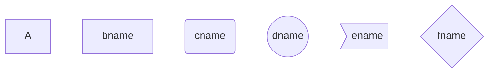
### 连线形状
```
graph LR
A1(A1)
A2(A2)
A1--长实线-->A2
B1(B1)
B2(B2)
B1-.长虚线.->B2
C1(C1)
C2(C2)
C1==长加粗实线==>C2
```
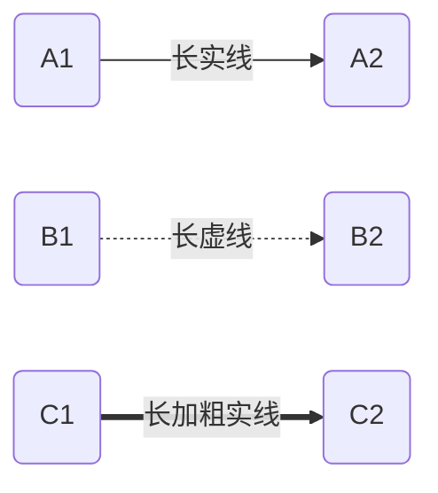
### 子图定义
```
graph LR
subgraph 子图标题1
    A1[123]
    A2[456]
end
subgraph 子图标题2
    B1[789]
    B2[910]
end
A1 --> A2
B1 --> B2
A1 ====> B2
A2 -..-> B1
```
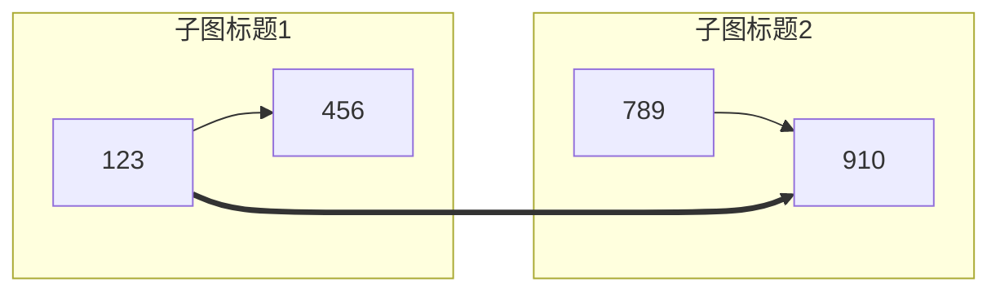
## UML类图
- 实现：<|..    示例：A<|..B:实现      类与接口的关系
- 继承：<|--   示例：C <|-- D:继承  子类与父类的关系
- 组合：*--     示例：E *-- F:组合    整体与部分的关系，部分不能离开整体单独存在。
- 聚合：o--     示例：G o-- H:聚合    整体与部分的关系，部分可以离开整体单独存在。
- 关联："1.." -- "1.."     示例：I "1..*" -- "1..*" J :关联    一种拥有关系，一个类知道另一个类的属性和方法。
- 依赖：<--     示例：K <-- L :依赖    一种使用关系，一个类的实现需要另一个类的协助。
```
classDiagram

class A
class B
A <|.. B:实现

class C
class D
C <|-- D:继承

class E
class F
E *-- F:组合

class G
class H
G o-- H:聚合

class I
class J
I "1..*" -- "1..*" J :关联

class K
class L
K <-- L :依赖
```
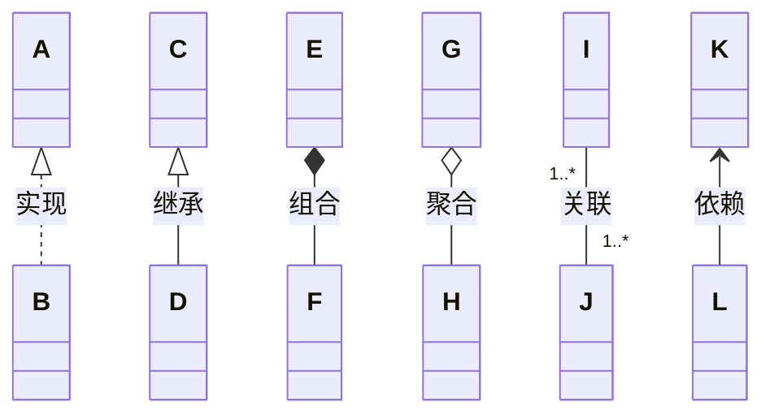
### 类成员变量和方法
```
classDiagram
class Student {
    +String name
    +int age
    - Address address
    +getAddress() Address
    -setAddress() void
}
```
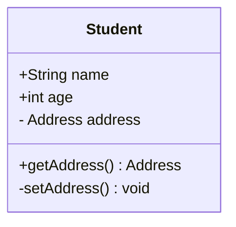
### 泛型
```
classDiagram
class A{
    +List~String~ list
}
```
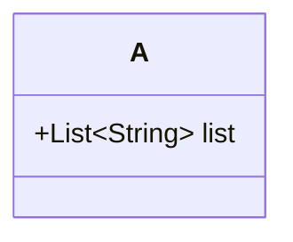
示例
```
classDiagram
class Run {
    <<interface>>
    +run() void
}
class Animal {
    <<abstract>>
    +run() void
}
class Dog {
    -Color color
    +eat(Food) void
    +run() void
}
class Color {
    <<enum>>
    -int r
    -int g
    -int b
}
class Food {
    +String name
}
Run <|.. Animal
Animal <|-- Dog
Dog <-- Food
Dog o--Color
```
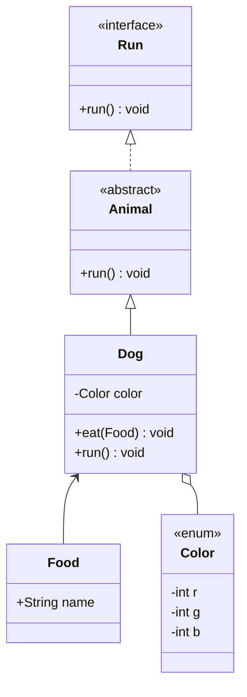
## 时序图
```
sequenceDiagram
客户端-->>服务器:发起请求
```
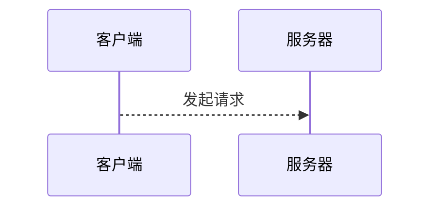
### 连线方式
|连线|表示|
|-|-|
|实线|->|
|带箭头的线|->>|
|虚线|-->|
|带箭头的虚线|-->>|
```
sequenceDiagram
客户端->>服务端:发起请求
服务端-->>数据库:读取数据
数据库-->>服务端:返回数据
客户端->>服务端:响应请求
```
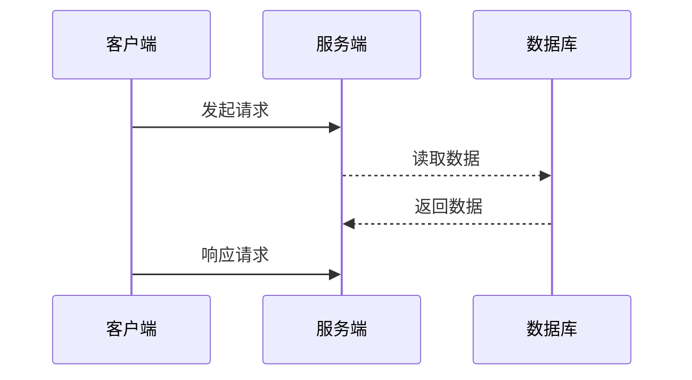
注释
```
Note 【位置】【对象】:【注释内容】

有三种位置:
right of
left of
over

sequenceDiagram
客户端->>服务器:发起请求
Note left of 客户端:left of 
Note over 客户端:over
Note right of 客户端:right of
```
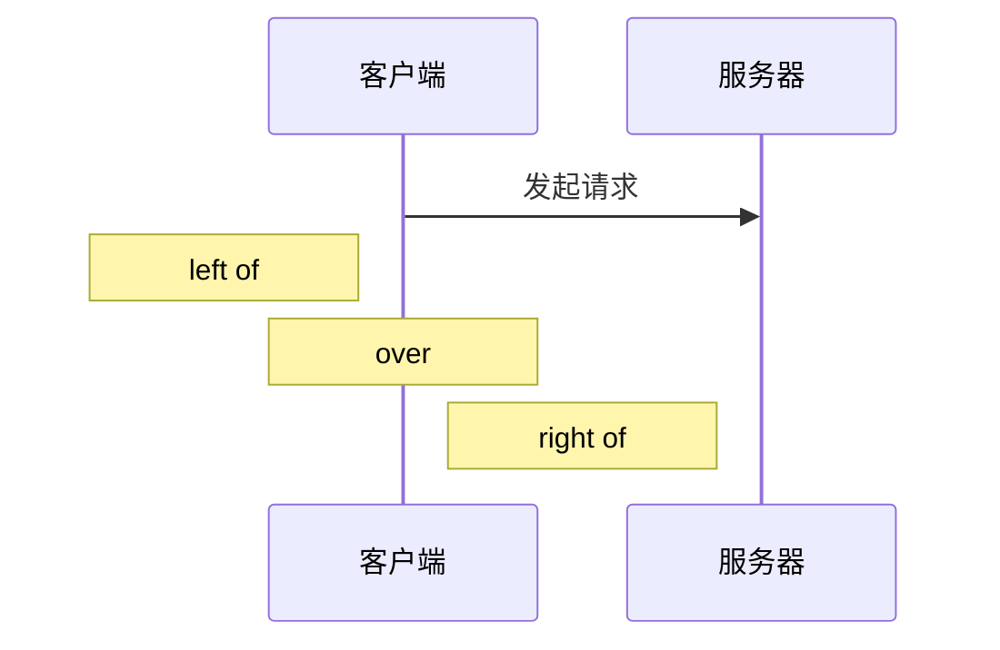
### 循环
```
sequenceDiagram
loop 重试
客户端->>服务器:发起请求
end
```

### 条件
```
sequenceDiagram
alt 条件
客户端->>服务器:发起请求
end
```
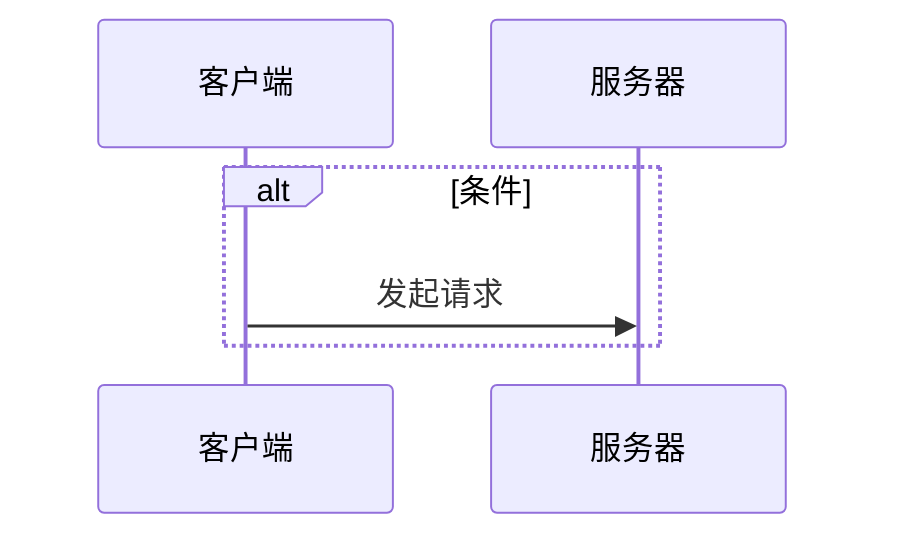
示例
```
sequenceDiagram
Note left of 客户端:页面、sdk等
客户端->>组件A:发起请求
alt 幂等
组件A->>组件B:提交任务
end
组件B->>组件A:返回已提交，待处理
组件A->>客户端:请求成功
loop 定时任务
组件B-->>组件B:执行任务
end
loop 定时任务
组件A->>组件B:查询任务
组件B->>组件A:返回任务
end
组件A->>客户端:通知任务完成
```
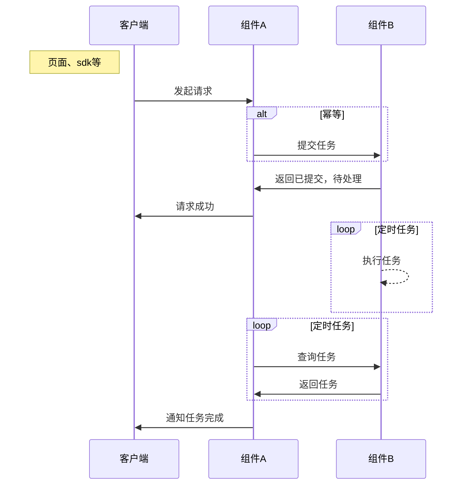
## 甘特图
```
gantt
    title Project Timeline
    dateFormat YYYY-MM-DD
    section Section Name
    Task Name         :done,    des1, 2014-01-06,2014-01-08
    Active Task       :active,  des2, after des1, 3d
    Future Task       :         des3, after des2, 5d
```
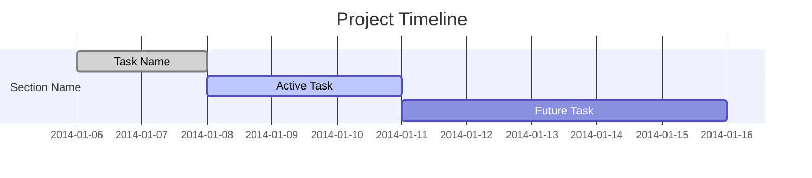
## 状态图
```
stateDiagram-v2
    [*] --> State1
    State1 --> State2 : Trigger / Action
    State2 --> [*]
```
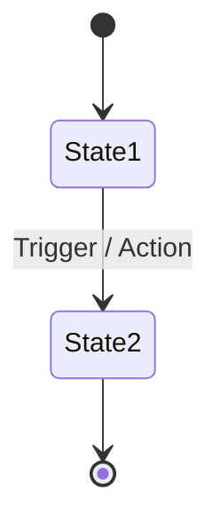
## 用户旅程图
```
wjourney
    title My working day
    section Go to work
      Make tea: 5: Me
      Go upstairs: 3: Me
    section Go home
      Sit down: 5: Me
```
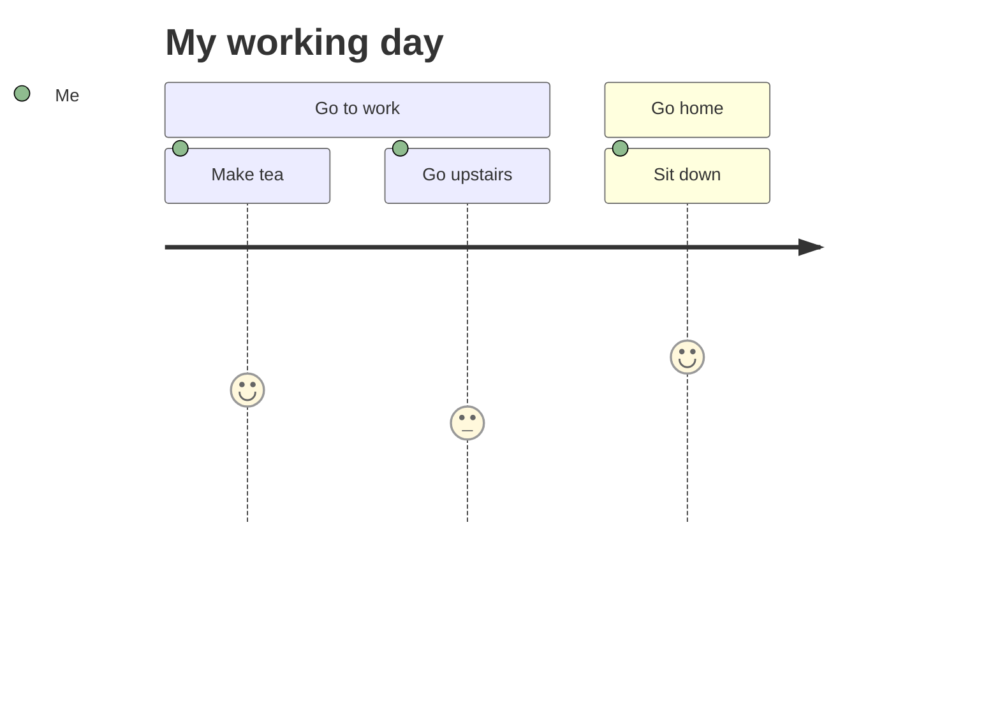